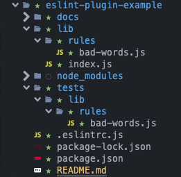

# ESLint: Custom plugins

----

## What is ESLint?

Statically analyzes your code to quickly find problems.

- Find issues
- Fix automatically
- Stricten code style

----

## Custom plugins?

An extension for ESLint that adds additional rules and configuration options.


---

## Create you own plugin


----

## Create folder & naming

Create you folder with the following naming convention:

- `eslint-plugin-<plugin-name>`
- `@<scope>/eslint-plugin-<plugin-name>`
- `@<scope>/eslint-plugin`

Note: Creating a folder is important because Yeoman won't... But details in the next slide

----

## Generate files

Install [Yeoman generator](https://www.npmjs.com/package/generator-eslint), then use it inside your previously created folder:

- `yo eslint:plugin`
- `yo eslint:rule`



----

## You're good to go!!!

Now you can:

- Configure your rules -> `meta` object
- Write you logic -> `create` function


---

## Meta object?

```js
meta: {
  type: 'problem', // `problem`, `suggestion`, or `layout`
  docs: {
    description: 'It does something... ¯\\_(ツ)_/¯',
    recommended: false,
    url: 'https://example.com', // documentation for the rule
  },
  messages: {badThingyHappened: 'How dare you use {{ example }}???'},
  fixable: 'code', // Or `code` or `whitespace`,
  schema: [
    'so-you-need-an-option': true,
  ], // Add a schema if the rule has options
}
```

----

## Create function?

Example:

```js
create(context): {
  ReturnStatement: function(node) {
    // at a ReturnStatement node while going down
  },
  // at a function expression node while going up:
  'FunctionExpression:exit': checkLastSegment,
  'ArrowFunctionExpression:exit': checkLastSegment,
  onCodePathStart: function (codePath, node) {
    // at the start of analyzing a code path
  },
  onCodePathEnd: function(codePath, node) {
    // at the end of analyzing a code path
  }
  // ...
}
```

AST [astexplorer.net](https://astexplorer.net/)

Note: Abstract Syntax Tree

----

## Report an issue

- Use `context.report()` function:

```js
context.report({
  node: node,
  messageId: 'badThingyHappened',
  data: {
    example: node.name,
  },
})
```

----

## Testing

RuleTester

```js
const ruleTester = new RuleTester();
ruleTester.run("bad-words", rule, {
  valid: [
    // give me some code that won't trigger a warning
  ],

  invalid: [
    {
      code: "const thisIsReallyReallyBadLol = 0;",
      errors: [{ message: "Fill me in.", type: "Me too" }],
    },
  ],
});
```

---

## What about typescript?

DEMOOOOO

---

## Sooo, that's it ¯\\\_(ツ)\_/¯


